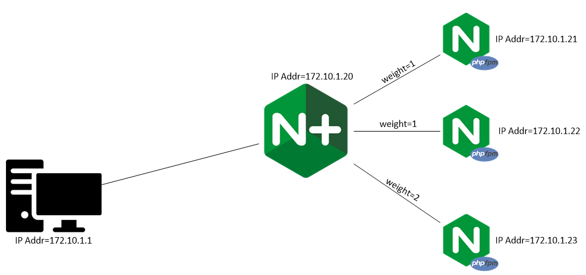

# NGINX Plus 
Basic demo with proxy to three upstreams containers. To run this same lab with Docker Compose please go to the [Compose](https://github.com/cwise24/nginx_lb/tree/master/Compose) folder.

The Docker Compose version also uses Prometheus to report and visualize NGINX Plus health metrics from it's API.

Docker images used
* richarvey/nginx-php=fpm {upstreams}
* NGINX PLUS              {load balancer}

# Prerequisites 

## Docker
Install Docker engine [here](https://docs.docker.com/get-docker/)

Need a Docker intro? [Docker 101](https://slides.com/cwise24/slides-for-developers)

## NGINX Plus
Sign up for your free NGINX tiral [here](https://www.nginx.com/free-trial-request/). Once you recieve your email, follow the link to activate your 30 day trial. Download both the Certificate and Key files.

Download the NGINX [Dockerfile](https://www.nginx.com/blog/deploying-nginx-nginx-plus-docker/) and place the Dockerfile and your nginx-repo.cert and nginx-repo.key in the nginx directory

## Create Docker Network (must define network so we can point to backend services)
Build a docker network  
``docker network create --driver=bridge --gateway=172.10.1.1 --subnet=172.10.1.0/24 docnet``

How do I see my containers IP Address?

`docker inspect -f '{{range .NetworkSettings.Networks}}{{.IPAddress}}{{end}}' container_name_or_id`

## Create Upstreams: Our backend servers

php1

``docker run --net docnet --ip 172.10.1.21 -p 81:80 -v ~/nginx_lb/php1/:/var/www/html/ --name php1 -h php1.nginx.lab -dit richarvey/nginx-php-fpm``

php2

``docker run --net docnet --ip 172.10.1.22 -p 82:80 -v ~/nginx_lb/php2/:/var/www/html/ --name php2 -h php2.nginx.lab -dit richarvey/nginx-php-fpm``

php3

``docker run --net docnet --ip 172.10.1.23 -p 83:80 -v ~/nginx_lb/php3/:/var/www/html/ --name php3 -h php3.nginx.lab -dit richarvey/nginx-php-fpm``

## NGINX Plus as a load balancer

lb_php

``docker run --net docnet --ip 172.10.1.20 -p 8081:80 -v ~/nginx_lb/lb_php/:/etc/nginx/conf.d/lb_php.conf --name lb_php -h lb_php.nginx.lab -dit nginx``

## Lab Design

## Page

Notice on top left is XFF, this is the X-Forwarded-For header inserted and to the top right will be the upstream container we are sending traffic to.

