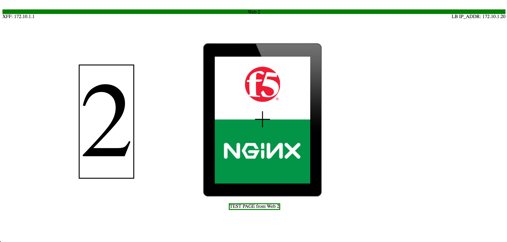

# NGINX Plus as load balancer
Basic demo with proxy and XFF

Docker images used
* richarvey/nginx-php=fpm {upstreams}
* NGINX PLUS              {load balancer}

Sign up for your free NGINX tiral [here](https://www.nginx.com/free-trial-request/). Once you recieve your email, follow the link to activate your 30 day trial. Download both the Certificate and Key files.

Download the NGINX [Dockerfile](https://www.nginx.com/blog/deploying-nginx-nginx-plus-docker/) and place the Dockerfile and your nginx-repo.cert and nginx-repo.key in the nginx directory

Build a docker network 
``docker network create --subnet=172.10.1.0/24 docnet``

# Create Upstreams: Our backend servers

php1

``docker run --net docnet --ip 172.10.1.21 -p 81:80 -v ~/nginx_lb/php1/:/var/www/html/ --name php1 -h php1.nginx.lab -dit richarvey/nginx-php-fpm``

php2

``docker run --net docnet --ip 172.10.1.22 -p 82:80 -v ~/nginx_lb/php2/:/var/www/html/ --name php2 -h php2.nginx.lab -dit richarvey/nginx-php-fpm``

php3

``docker run --net docnet --ip 172.10.1.23 -p 83:80 -v ~/nginx_lb/php3/:/var/www/html/ --name php3 -h php3.nginx.lab -dit richarvey/nginx-php-fpm``

# NGINX as a load balancer: Reverse Proxy with Health Monitor

lb_php

``docker run --net docnet --ip 172.10.1.20 -p 8081:80 -v ~/nginx_lb/lb_php/:/etc/nginx/conf.d/lb_php.conf --name lb_php -h lb_php.nginx.lab -dit nginx``

